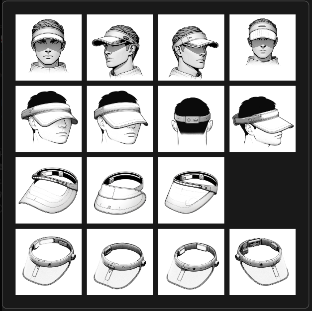

# Seasonal Affective Disorder: Understanding the Impact

Seasonal Affective Disorder (SAD) represents a recurrent depressive episode that typically manifests during the lower-light conditions of winter. Characterized within the DSM-5 as a major depressive disorder with a seasonal pattern, the diminished exposure to sunlight is a well-established trigger (DSM-5; APA).

---

### Light Therapy: A Standard Treatment for SAD

Light therapy, a first-line treatment for SAD, leverages artificial light to replicate the benefits of natural sunlight. This intervention prompts a chemical change in the brain, notably affecting neurotransmitters such as melatonin and serotonin, which are instrumental in mood regulation and sleep patterns (Rosenthal, 2023).

**Importance of Light**

Research underscores the importance of light intensity and spectrum in light therapy. Standard treatment recommends a 10,000 lux light box used for 20-30 minutes each morning, a level of illumination that compensates for the deficit of natural light in winter (Rosenthal, 2023; Verywell Health).

### Navigating Through Limitations of Current Technologies

While existing light therapy devices have set a precedent in treating SAD, their design often restricts user mobility and fails to fully mimic the natural experience of sunlight.

### The Science of Light Positioning

Emerging research highlights the importance of light positioning in light therapy's effectiveness for SAD. The SAD Visor's design principle is to provide optimal light exposure in a wearable format conducive to the user's lifestyle (Rosenthal, 2023).

---

## Innovative Design: The Visor-Integrated Light Therapy Solution

The concept of integrating a light therapy lamp into a visor offers an innovative solution that caters to the naturalistic approach required for effective SAD treatment. 

---

## Design and Technical Considerations

The SAD Visor is envisioned as a wearable innovation that marries functionality with everyday practicality.

**Materials**
- Durability and Comfort: A combination of durable materials such as polycarbonate.
- Biocompatibility: Contact materials are chosen for their hypoallergenic properties.

**Light Sources**
- LED Technology: Blue/green spectrum LEDs are selected for their effectiveness.

**Power Sources**
- Rechargeable Batteries: Lithium-ion batteries are chosen for their energy density.

**Ergonomics**
- Weight and Control: The visor's design ensures even weight distribution.
- Aesthetics: The design is both contemporary and discreet.

## Technical Feasibility

The device will deliver light intensity within the therapeutic range, ensuring uniform distribution.

## Market Viability and Competitive Positioning

The SAD Visor's modern design and functionality set it apart from dated market alternatives.

---

## Connect and Follow the Advent of Design Journey

- [Twitter](https://twitter.com/amitoser)
- [GitHub](https://github.com/lukketsvane)
- [Instagram](https://www.instagram.com/smeltevatn/)
- [LinkedIn](https://www.linkedin.com/in/iverfinne/)
