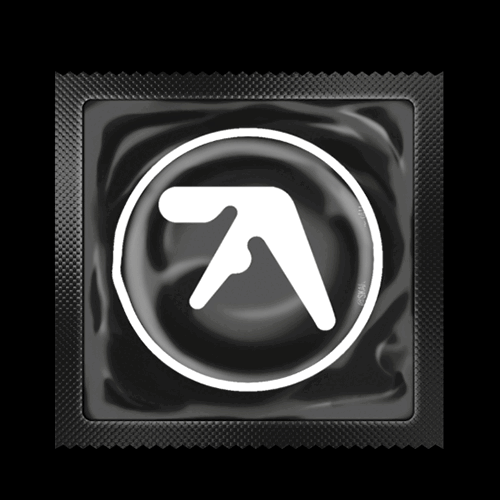
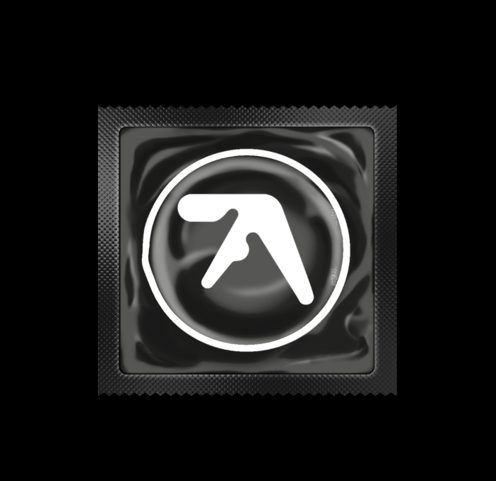

# Minimalist Condom Packaging Design

## Project Overview

### The Challenge

To create a packaging design that encapsulates modernity, functionality, and environmental consciousness.

### The Solution

A minimalist condom wrapper that combines a sleek design with a clear indication of the high-tech nature of the product, using an abstract symbol.

## Design Process

### Concept Development

The aim was to combine a minimalist aesthetic with an allusion to the cutting-edge technology used in the product. The chosen design is both abstract and indicative of the product’s advanced features.

### Execution

#### Material Selection

Selected biodegradable materials underscore the brand's eco-friendly commitment.

#### Typography & Color Scheme

A monochromatic color scheme was chosen to emphasize the product's sleek and sophisticated design.

## Final Product

### Day 1 Release

The animated representation of the packaging design captures the dynamic and innovative spirit of the product.

### Static Design

The static image showcases the detail and thought put into the physical texture and design elements of the packaging.

## Conclusion

This design stands as a statement of the brand's innovative approach, combining state-of-the-art technology with a commitment to sustainability.

## Contact

For more information on this project, please contact [Your Email](mailto:youremail@example.com).

### Footnotes

- Insights on the design inspiration [^1].
- Explore more of my design work [^2].

[^1]: This design is inspired by contemporary minimalism and the seamless integration of technology with consumer products.

[^2]: For a comprehensive view of my design portfolio, feel free to reach out.
